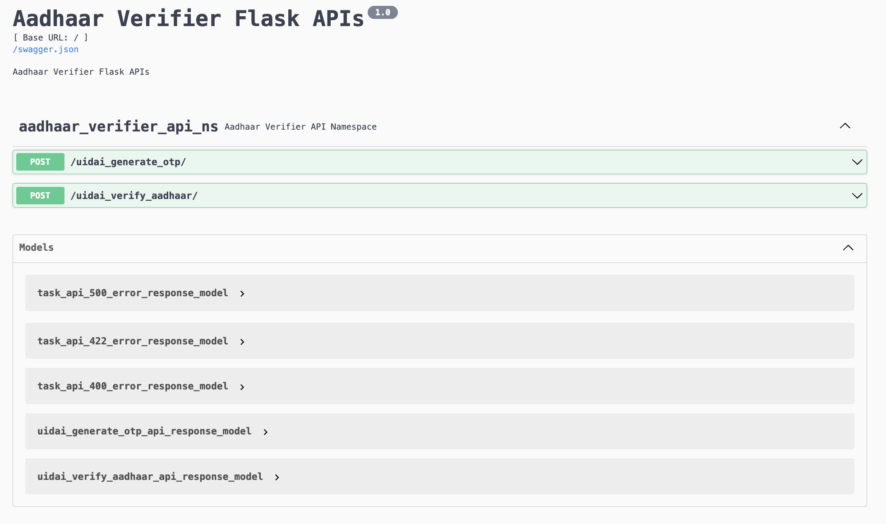

# Aadhaar Verifier

A prototype for verification of customers' KYC data using indian government's UIDAI Aadhaar database.

## Requirements

- Python 3.6

## How To Run?

- docker compose up --build --detach
- Access <http://127.0.0.1:9000/>
- docker compose logs --timestamps --follow
- docker compose down
